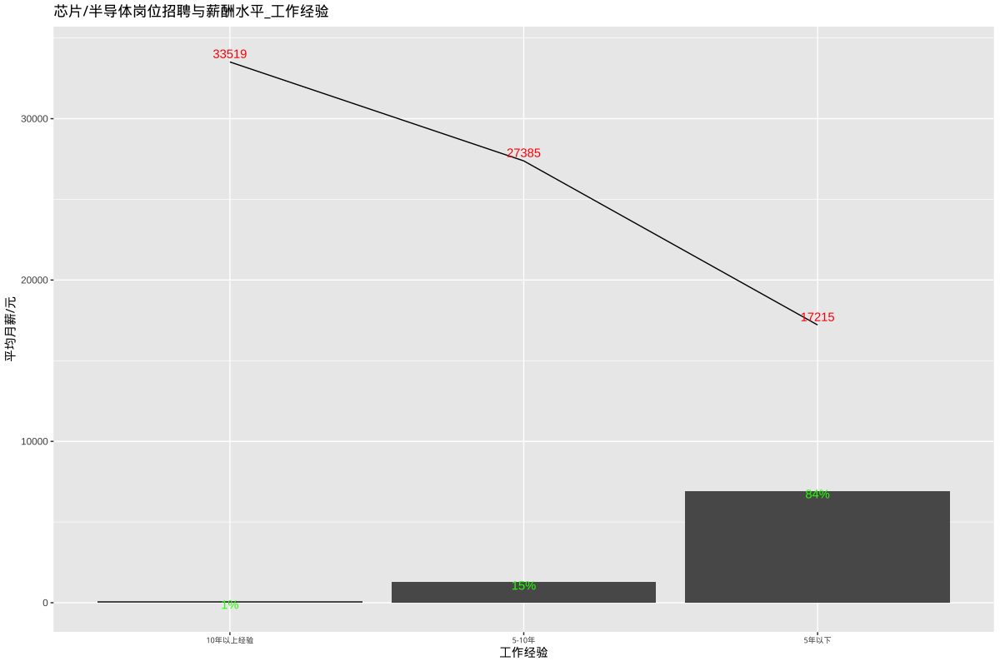
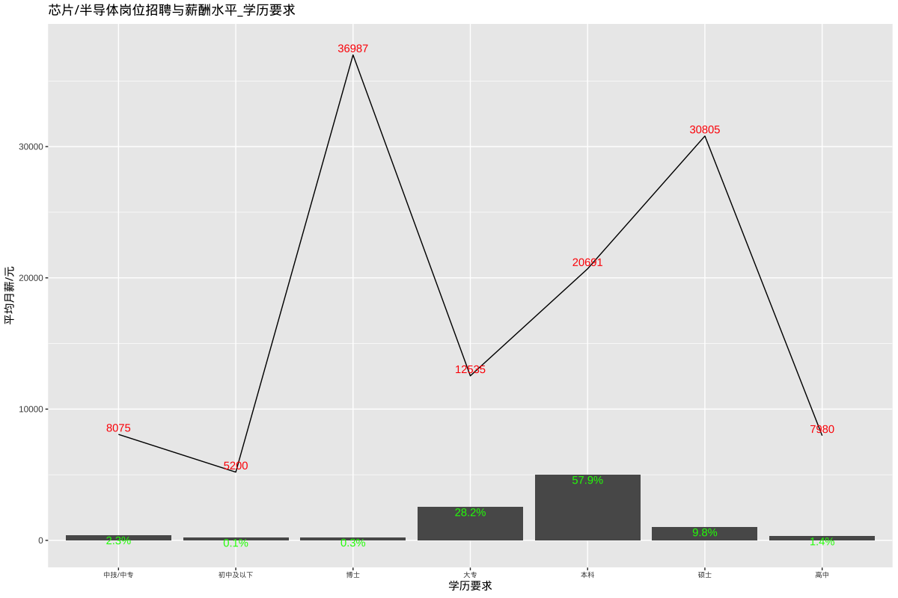

# 芯片/半导体相关岗位招聘和薪酬

## 总述

本次采集有效数据8295条(城市发布量\>=100)，主要分析与芯片和半导体相关的岗位招聘和薪酬，岗位如： FPGA工程师、FAE工程师、工艺工程师、版图设计工程师、模拟IC设计工程师、数字IC设计工程师、PIE工程师、PCB Layout工程师等。我们将从如下方面分析：

-   01.城市分布：招聘需求主要集中在深圳和上海，分别占市场需求的24%和22%，平均月薪分别为16852元和23792元，其余城市在8%或以下。

-   02.行业分布：市场66%的招聘主要集中于电子/半导体/集成电路，平均月薪19875元。

-   03.公司规模：\<1000人企业占84%，平均月薪19212元；1000-5000人占12%，平均月薪16837元。

-   04.公司类型：民企占60%，平均月薪18573元；外企占18%，平均月薪18877元。

-   05.工作经验：5年以下占84%，平均月薪17215元；5-10年占15%，平均月薪27385元。

-   06.学历要求：本科占58%，平均月薪20691元；大专占28%，平均月薪12535元。

## 01.城市分布

## 02.行业分布

## 03.公司规模

## 04.公司类型

## 05.工作经验

## 06.学历要求

